# La barre d'action du sélecteur d'échantillons — 8 propositions

*Dubaï Parfumerie · 8 septembre 2026 · document de travail pour la direction*

La barre sombre fixée en bas de la page « Composez votre sélection d'échantillons » est le dernier élément que le visiteur voit avant d'acheter. Elle porte aujourd'hui quatre choses à la fois : douze cases vides, un compteur, un réglage de taille de coffret et un bouton d'achat. Ce document rend compte de ce que ces quatre zones font réellement à l'écran — mesures à l'appui — et propose huit changements, chacun illustré d'une maquette. **Rien n'a été modifié dans le site.**

Toutes les mesures ont été relevées sur `http://localhost:3003/preview/selecteur-echantillons`, catalogue réel (31 flacons Reef Perfumes en stock), coffrets de 1 / 3 / 6 / 12 / 20.

## Sommaire

1. **Un bouton qui mène toujours quelque part** — impact ★★★★★ · effort M
2. **Le prix, dans la barre** — impact ★★★★★ · effort S
3. **Une pile de miniatures à la place des douze cases** — impact ★★★★☆ · effort M
4. **Une barre qui change selon le moment du parcours** — impact ★★★★☆ · effort M
5. **Retirer un flacon au doigt et au clavier** — impact ★★★★☆ · effort S
6. **La taille du coffret : un réglage, pas une action** — impact ★★★☆☆ · effort M
7. **Ne plus dire deux fois la même chose** — impact ★★★☆☆ · effort S
8. **Contrastes et cibles au doigt** — impact ★★★☆☆ · effort S

## Comment lire

- **Impact** : de 1 à 5 étoiles, effet attendu sur la mise au panier et sur le confort d'usage. Estimation, à confirmer en situation réelle.
- **Effort** : S = une journée à deux · M = trois à cinq jours · L = plus d'une semaine. Aucune proposition n'est en L.
- Les couleurs restent celles de la maison : encre `#1c1a17`, ivoire `#f6f1e7`, or `#c2a15b`.

---

## État des lieux — ce qui a été mesuré

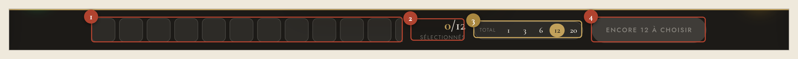

La barre mesure **76 px de haut** à toutes les largeurs d'écran, du téléphone à l'ordinateur. Sur un écran de 1440 px, son contenu tient dans 1180 px et se répartit ainsi :

| # | Zone | Largeur | Part de la barre | Ce qu'elle apporte |
|---|---|---|---|---|
| 1 | Rangée d'emplacements | 575 → 592 px | **49 %** | ne dit rien tant qu'aucun flacon n'est choisi, et ne les montre jamais tous ensuite ; bord à 1,49 : 1 |
| 2 | Compteur « 0/12 sélectionnés » | 100 px | 8 % | répète le bouton juste à côté, et le bandeau du haut |
| 3 | Réglage « Total 1 3 6 12 20 » | 201 px | 17 % | un réglage traité comme une action, masqué sous 620 px |
| 4 | Bouton d'action | 194 → 212 px | 17 % | désactivé pendant tout le parcours, texte à 2,95 : 1 |

**La rangée d'emplacements ne tient sur aucun écran.** Douze cases de 44 px avec 7 px d'écart réclament **605 px** ; la zone en offre 575 à 592. Vingt cases réclament **1013 px**.

| Largeur d'écran | Place offerte aux cases | Cases réellement visibles (coffret de 12) |
|---|---|---|
| 1440 px | 592 px | 11 sur 12 — la douzième est coupée |
| 1024 px | 427 px | 7 sur 12 (71 % de la rangée) |
| 768 px | 171 px | 3 sur 12 (**28 %**) — le réglage garde ses 201 px |
| 620 px | 303 px | 6 sur 12 (50 %) |
| 390 px | 66 → 82 px | **1 sur 12** |

Sur un coffret de 20 et un écran de 1440 px, **neuf flacons choisis sur vingt sont hors champ**, coupés au milieu d'une case, sans flèche ni ombre ni compteur pour signaler qu'il y a une suite.

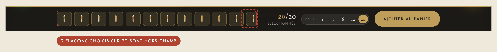

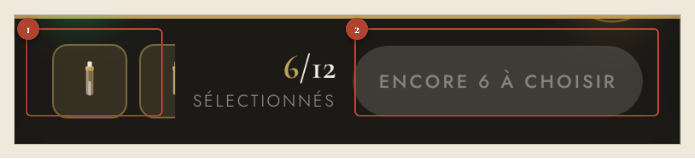

Autres relevés :

- **Contraste du bouton désactivé : 2,95 : 1.** Le minimum réglementaire pour un texte est de 4,5 : 1. C'est l'élément le plus large de la barre, et il est illisible pendant tout le parcours.
- **Contraste du bord des cases vides : 1,49 : 1.** Le minimum pour un élément non textuel est de 3 : 1. À zéro sélection, la moitié gauche de la barre est un aplat gris sans message.
- **Le × de retrait est en `display:none` hors survol.** Sur téléphone il n'y a pas de survol : *aucun flacon ne peut être retiré depuis la barre*. Au clavier non plus — la tabulation depuis le bouton d'achat saute la rangée entière et repart directement dans la grille de produits.
- **Cibles tactiles** : les chiffres 1 / 3 / 6 / 12 / 20 font **28 × 25 px** (44 × 44 recommandé) ; le × de retrait fait 17 × 17 px.
- **Le réglage de taille disparaît sous 620 px de large**, c'est-à-dire sur tous les téléphones.
- **Le prix n'apparaît nulle part.** On met au panier un coffret de 20 sans avoir jamais vu ce qu'il coûte, ni ce que coûtait celui de 6.
- **La barre du haut dit déjà la même chose** : elle porte un compteur « 6/12 » avec sa jauge dorée et un sélecteur « 12 échantillons · 1 3 6 12 20 ». Le visiteur voit deux compteurs et deux sélecteurs de taille sur le même écran.

---

## 01. Un bouton qui mène toujours quelque part

**Impact** ★★★★★ · **Effort** M · Vague 1

### Constat

Le bouton n'est actif qu'à `total === MAX`. Pour un coffret de 12, cela veut dire qu'il est éteint pendant **douze clics sur douze**, et pour un coffret de 20, pendant vingt. Le plus gros élément de la barre, celui vers lequel l'œil va d'abord, est inerte du début à la fin — sauf à la toute dernière seconde. Son libellé, « Encore 12 à choisir », est un reproche, pas une action.

Pendant ce temps le bloc « Laissez la maison compléter », qui fait exactement ce qu'il faut, est perdu au milieu de la page, hors de vue dès qu'on descend dans la grille.

### Proposition

Le bouton reste toujours actif. Son libellé dit ce qui se passera : **« La maison complète · Ajouter »** tant que le coffret n'est pas plein, **« Ajouter au panier »** quand il l'est. Le sous-titre du compteur précise le partage : « 6 choisis · 6 libres ». Un second bouton, discret et bordé, offre l'autre voie : « Je choisis les 6 derniers ».

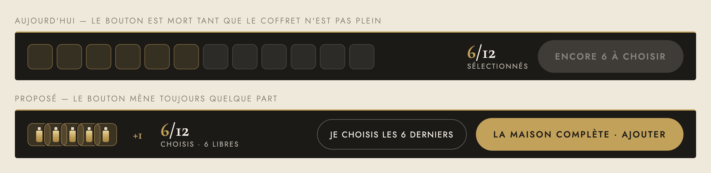

### Bénéfice pour le visiteur

Il peut acheter à tout moment. Celui qui a trouvé trois coups de cœur et ne connaît pas les vingt-huit autres n'est plus bloqué : il fait confiance à la maison pour le reste. C'est la proposition qui a le plus d'effet direct sur la mise au panier — aujourd'hui, un visiteur qui s'arrête à 8 sur 12 repart les mains vides alors qu'il était prêt à payer.

---

## 02. Le prix, dans la barre

**Impact** ★★★★★ · **Effort** S · Vague 1

### Constat

La barre décide d'un achat sans jamais montrer de montant. Le visiteur choisit entre un coffret de 1, 3, 6, 12 ou 20 sans savoir ce que chacun coûte, puis appuie sur « Ajouter au panier » et découvre le prix à l'étape suivante. C'est le seul endroit du site où l'on engage une dépense à l'aveugle.

### Proposition

Le prix s'affiche dans la barre, en Cormorant doré, juste avant le bouton, et suit le réglage de taille. Une seconde ligne, très discrète, donne le prix à l'unité — c'est l'argument des grands coffrets.

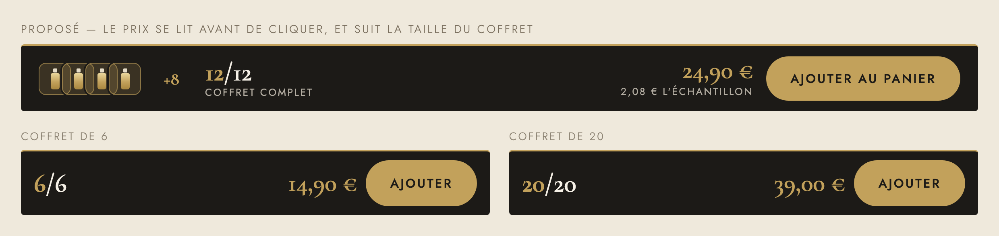

### Bénéfice pour le visiteur

Il sait ce qu'il paie avant de cliquer, et il voit l'intérêt de monter en taille : 2,08 € l'échantillon à 12, contre 2,48 € à 6. C'est le levier le plus simple pour augmenter le panier moyen, et il ne demande qu'une ligne de plus dans la barre.

---

## 03. Une pile de miniatures à la place des douze cases

**Impact** ★★★★☆ · **Effort** M · Vague 1

### Constat

La rangée de cases occupe la moitié de la barre pour ne jamais montrer la sélection en entier. Elle ne tient pas à 1440 px, elle en montre 28 % à 768 px, et une case et demie sur un téléphone. À vingt emplacements, neuf choix sont hors champ. Et quand aucun flacon n'est choisi, ces douze rectangles gris ne disent rien du tout : ils occupent 575 px pour signifier « vide ».

### Proposition

Cinq miniatures superposées en éventail, un compteur « +15 », et c'est tout : **140 px au lieu de 592**, largeur constante que le coffret fasse 1 ou 20. La pile est un bouton : elle ouvre la liste complète (proposition 05). La place libérée accueille le prix et le réglage.

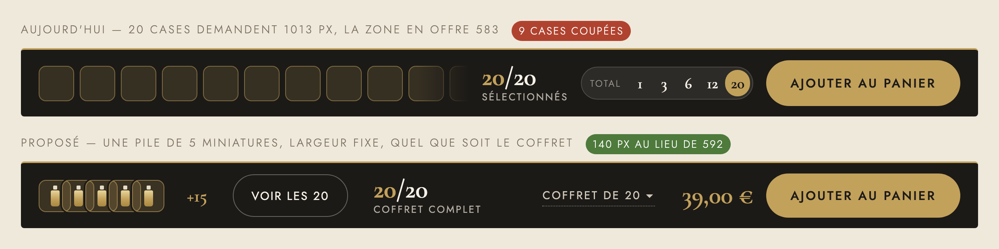

### Bénéfice pour le visiteur

Il voit enfin quelque chose de juste : la pile ne ment pas sur le nombre, alors que la rangée coupée laisse croire qu'on a choisi onze flacons quand on en a vingt. Et sur téléphone, la barre redevient lisible.

---

## 04. Une barre qui change selon le moment du parcours

**Impact** ★★★★☆ · **Effort** M · Vague 2

### Constat

La barre affiche exactement la même chose à zéro sélection, à mi-parcours et à coffret plein : les mêmes quatre zones, aux mêmes largeurs, dans le même ordre. Les mesures le confirment — entre 0/12 et 12/12, la seule chose qui bouge est la couleur du bouton. Un visiteur qui arrive sur la page voit d'abord douze rectangles vides ; un visiteur qui a fini voit toujours son réglage de taille au même endroit que le bouton d'achat.

### Proposition

Trois états, un par moment :

1. **Rien de choisi** — la barre présente le coffret et son prix, et propose de commencer (« Laisser la maison composer »). Aucune case vide.
2. **En cours** — la pile de miniatures, le compte des emplacements libres, le prix, le bouton qui complète.
3. **Complet** — le liseré passe à l'or clair, tout s'efface sauf le prix et « Ajouter au panier », en plus grand.

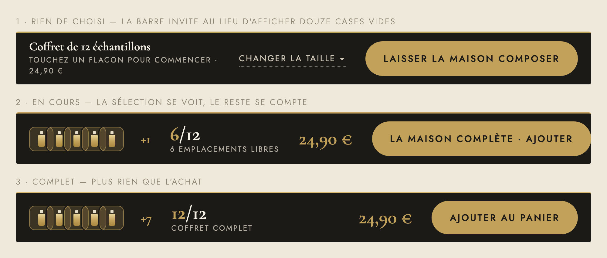

### Bénéfice pour le visiteur

À chaque instant, la barre ne montre que ce qui sert à l'instant suivant. Le début invite au lieu d'exhiber un vide, et la fin ne présente plus qu'une seule chose à faire.

---

## 05. Retirer un flacon au doigt et au clavier

**Impact** ★★★★☆ · **Effort** S · Vague 1

### Constat

C'est le défaut le plus sévère et le moins visible. Le petit × qui retire un flacon est déclaré `display:none` et n'apparaît qu'au survol de la souris. Sur téléphone, il n'y a pas de survol : **on ne peut retirer aucun flacon depuis la barre**. Au clavier non plus : `display:none` retire l'élément de l'ordre de tabulation, et la vérification le confirme — depuis le bouton d'achat, la tabulation arrière saute la rangée entière et repart dans la grille.

S'ajoute un problème d'identification : les cases affichent un flacon dessiné, teinté par famille. Douze flacons de la même famille donnent douze cases identiques. Le visiteur ne sait pas ce qu'il a choisi.

### Proposition

Un × permanent sur chaque miniature, cible de 44 px. La pile ouvre une feuille « Ma sélection » qui liste les flacons **par leur nom**, avec un bouton « Retirer » de pleine hauteur. Même geste sur téléphone et sur ordinateur, et l'ensemble devient atteignable au clavier.

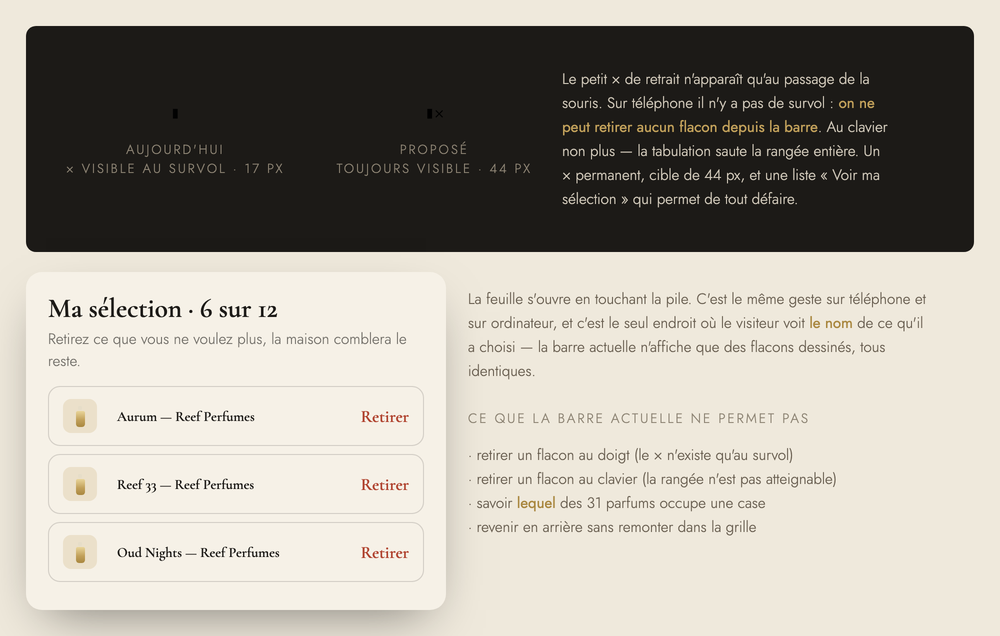

### Bénéfice pour le visiteur

Il peut revenir sur un choix. Aujourd'hui, sur téléphone, une erreur de sélection oblige à retrouver la carte dans une grille de trente et un produits — ou à recommencer.

---

## 06. La taille du coffret : un réglage, pas une action

**Impact** ★★★☆☆ · **Effort** M · Vague 2

### Constat

Le sélecteur « Total 1 3 6 12 20 » occupe 201 px — 17 % de la barre, presque autant que le bouton d'achat — et lui ressemble : même pilule, même pastille dorée pleine sur l'option retenue. Deux choses de nature très différente ont la même carrure. Puis, sous 620 px de large, il disparaît complètement : sur téléphone, changer la taille du coffret demande de remonter toute la page.

Ses cibles font 28 × 25 px, sous les 44 × 44 recommandés au doigt.

### Proposition

Un libellé discret et souligné en pointillé, **« Coffret de 12 · 24,90 € ▾ »**, qui ouvre une feuille où chaque taille montre son prix — au moment précis où l'on hésite entre 6 et 20. Cette feuille existe à toutes les largeurs, téléphone compris, et ses lignes font 52 px de haut.

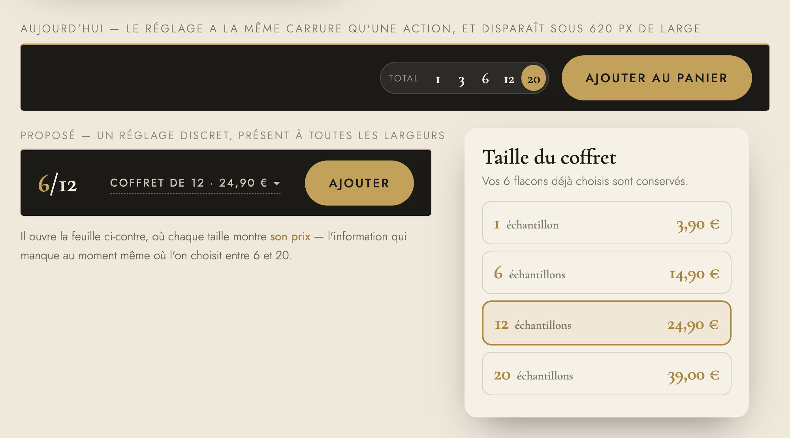

### Bénéfice pour le visiteur

Un seul élément a l'allure d'un bouton dans la barre : celui qui achète. Et le choix de la taille se fait avec les prix sous les yeux, sur tous les écrans.

---

## 07. Ne plus dire deux fois la même chose

**Impact** ★★★☆☆ · **Effort** S · Vague 2

### Constat

Le bandeau du haut porte une pastille « 6/12 » avec une jauge dorée de douze traits, et un sélecteur « 12 échantillons · 1 3 6 12 20 ». La barre du bas porte un compteur « 6/12 sélectionnés » et un sélecteur « Total · 1 3 6 12 20 ». Le même écran affiche **deux compteurs et deux sélecteurs de taille**. En prime, le bouton dit une troisième fois la même chose : « Encore 6 à choisir ».

### Proposition

Un seul endroit par information. Le bandeau du haut ne garde que ce qui lui revient — la recherche et les filtres, qui pilotent la grille. La barre du bas porte l'avancement, le prix, le réglage et l'achat, parce que c'est là que se prend la décision et que c'est toujours visible.

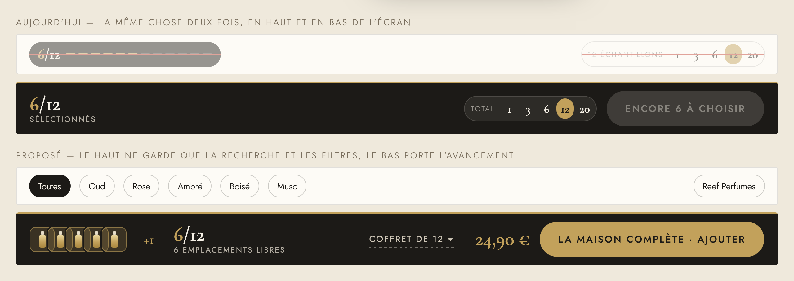

### Bénéfice pour le visiteur

Moins d'éléments à lire, et plus de doute sur lequel des deux sélecteurs fait foi. Le haut de page gagne aussi de la hauteur pour la grille de produits.

---

## 08. Contrastes et cibles au doigt

**Impact** ★★★☆☆ · **Effort** S · Vague 1

### Constat

Trois mesures, trois seuils manqués :

| Élément | Mesuré | Exigé | Écart |
|---|---|---|---|
| Texte du bouton désactivé | **2,95 : 1** | 4,5 : 1 | échec |
| Bord des cases vides | **1,49 : 1** | 3 : 1 | échec |
| Cibles du sélecteur de taille | **28 × 25 px** | 44 × 44 px | échec |

Le reste tient : le compteur doré est à 7,06 : 1, « sélectionnés » à 6,28 : 1, « Total » à 5,46 : 1.

### Proposition

Le bouton en attente devient un contour doré sur fond sombre — **8,1 : 1**, lisible, et visiblement cliquable puisqu'il le sera (proposition 01). Les cases vides, si l'on en garde, passent au pointillé doré à **3,4 : 1** : le pointillé dit « à remplir », l'aplat gris ne disait rien. Les cibles du réglage montent à 44 × 44 px, les tailles rares (1 et 3) passant dans la feuille.

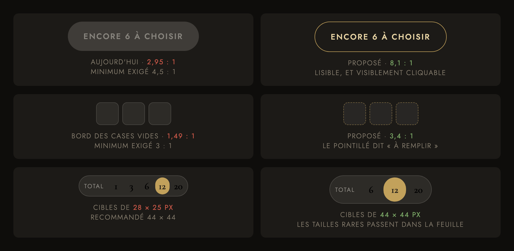

### Bénéfice pour le visiteur

La barre reste lisible dans une vitrine en plein jour, sur un écran de téléphone incliné, et pour un client de cinquante ans. C'est aussi ce que demandent les règles d'accessibilité auxquelles un site marchand est tenu.

---

## Sur téléphone — avant / après

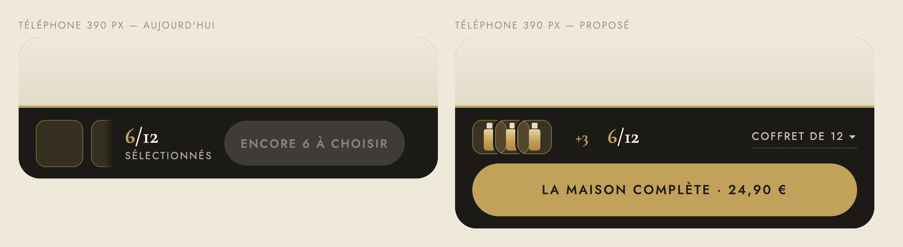

Le téléphone est le cas le plus dur et celui où les huit propositions se cumulent le mieux : la rangée inutile disparaît, le réglage revient, le prix apparaît, et le bouton pleine largeur devient enfin actionnable.

---

## Récapitulatif — impact × effort

| # | Proposition | Impact | Effort | Vague |
|---|---|---|---|---|
| 01 | Un bouton qui mène toujours quelque part | ★★★★★ | M | 1 |
| 02 | Le prix, dans la barre | ★★★★★ | S | 1 |
| 03 | Une pile de miniatures à la place des douze cases | ★★★★☆ | M | 1 |
| 04 | Une barre qui change selon le moment | ★★★★☆ | M | 2 |
| 05 | Retirer un flacon au doigt et au clavier | ★★★★☆ | S | 1 |
| 06 | La taille du coffret : un réglage, pas une action | ★★★☆☆ | M | 2 |
| 07 | Ne plus dire deux fois la même chose | ★★★☆☆ | S | 2 |
| 08 | Contrastes et cibles au doigt | ★★★☆☆ | S | 1 |

### Ordre de mise en œuvre

**Vague 1 — deux à trois jours, effet immédiat sur la vente**
`02` le prix → `08` les contrastes → `01` le bouton toujours actif → `05` le retrait au doigt → `03` la pile de miniatures.

L'ordre compte : le prix et les contrastes ne dépendent de rien et se posent en quelques heures. Le bouton toujours actif s'appuie sur la logique de complétion automatique qui existe déjà (`Compléter (6)` dans le bloc du milieu) — il s'agit de la rapatrier dans la barre. La pile de miniatures vient après, parce qu'elle libère la place dont le prix a besoin.

**Vague 2 — trois à cinq jours, mise au propre**
`06` la feuille de réglage → `07` la suppression du doublon avec le bandeau du haut → `04` les trois états de la barre.

Ces trois-là se tiennent : la feuille de réglage rend possible le retrait du sélecteur de la barre, ce qui rend possible le nettoyage du bandeau du haut, ce qui rend possibles les trois états.

### Points de vigilance

- La hauteur de la barre est publiée dans la variable `--dp-bottombar-h` et lue par la barre d'aperçu mobile/tablette/ordinateur. Toute proposition qui change la hauteur (04 sur téléphone) doit conserver cette mesure dynamique.
- Le composant est autonome : la barre, ses styles et sa logique tiennent dans `src/components/sample-selector/SampleSelector.tsx`. Aucune des huit propositions ne touche au reste du site.
- Les prix cités dans les maquettes (3,90 / 14,90 / 24,90 / 39,00 €) sont des exemples. Le composant ne connaît aujourd'hui qu'un prix unique de coffret (`coffretPrice = 24,90 €`), quelle que soit la taille choisie : **une grille de prix par taille reste à décider.** C'est le préalable à la proposition 02.
- Seule la maison Reef Perfumes est en stock : 31 flacons pour un coffret de 20, soit très peu de marge de choix. La complétion automatique (proposition 01) est d'autant plus utile.

---

*PDF mis en pages : `ameliorations-barre-echantillons-2026-09-08.pdf` (14 pages). Captures, maquettes et source HTML du PDF : dossier `ameliorations-barre-echantillons-2026-09-08-assets/`. Mesures relevées le 8 septembre 2026 sur la page de prévisualisation, catalogue réel.*
