# 10 propositions d'amélioration visuelle du Jumeau olfactif

*Dubaï Parfumerie · 7 septembre 2026 · document de travail pour la direction*

Ce que le visiteur voit aujourd'hui, ce qu'il pourrait voir demain — et ce que cela change pour la vente. Chaque proposition est illustrée d'une maquette (dossier `ameliorations-jumeau-olfactif-2026-09-07-assets/`).

## Sommaire

1. **Le prix économisé, affiché noir sur blanc** — impact ★★★★★ · effort S
2. **Le face-à-face des deux flacons** — impact ★★★★☆ · effort M
3. **Une jauge de proximité que l'on comprend** — impact ★★★★☆ · effort S
4. **Le badge de confiance : « jumeau documenté » ou « rapprochement olfactif »** — impact ★★★★☆ · effort S
5. **Le point d'entrée : pastilles visuelles et autocomplétion qui renseigne** — impact ★★★★☆ · effort M
6. **Sur mobile : la carte bord à bord et un bouton d'achat qui suit** — impact ★★★★☆ · effort M
7. **La pyramide de notes comparée** — impact ★★★☆☆ · effort M
8. **Un état d'ouverture qui donne envie de chercher** — impact ★★★☆☆ · effort S
9. **Partager son jumeau : lien direct et WhatsApp** — impact ★★★☆☆ · effort S
10. **La révélation du jumeau (animation d'une seconde)** — impact ★★☆☆☆ · effort M

## Comment lire

- **Impact** : étoiles de 1 à 5, effet attendu sur la conversion, la confiance et l'expérience (estimation, à confirmer par test A/B).
- **Effort** : S = quelques jours (données déjà disponibles) · M = une à deux semaines · L = plus de deux semaines. Aucune proposition en L.
- Cadre légal conservé : marques citées en texte seul, aucun logo, vocabulaire « inspiré de » / « jumeau olfactif ».

## État des lieux

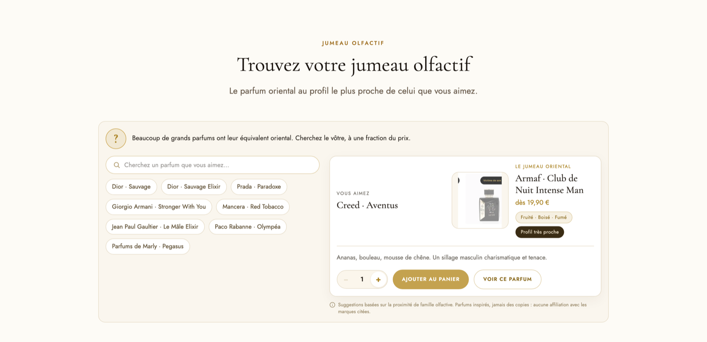

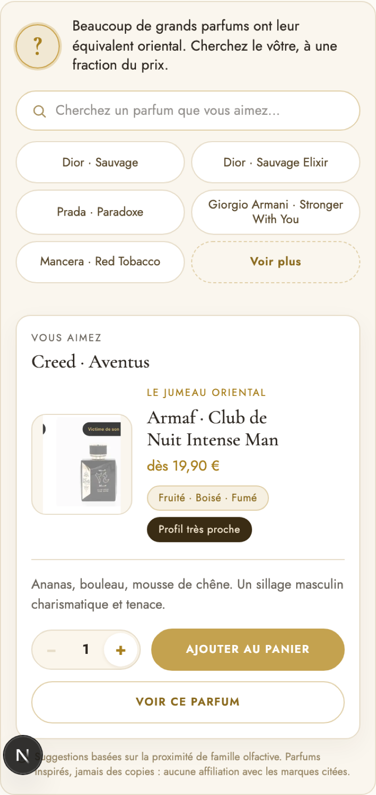

Six constats : économie jamais chiffrée · un seul badge pour tous · pas de mise en scène · point d'entrée en texte · mobile trop long · incohérences de données visibles (Aventus 19,90 € / 49,90 €, résultat imposé à l'ouverture, description brute de fiche).

## 01. Le prix économisé, affiché noir sur blanc

**Impact** ★★★★★ Très fort · **Effort** S — quelques jours · Vague 1 · gains rapides

### Constat

La carte annonce « dès 35,00 € » (ou 49,90 €) mais ne dit jamais ce que coûte l'original. L'intro promet pourtant « une fraction du prix ». Le prix indicatif de l'original (≈ 320 € pour Aventus, ≈ 110 € pour Black Opium…) est déjà saisi dans nos données : il n'est simplement pas affiché. Le visiteur doit faire le calcul lui-même — ou ne le fait pas.

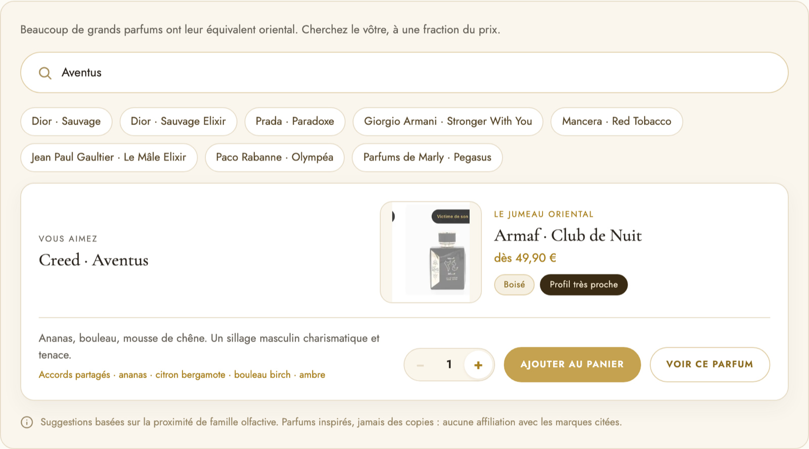

*Aujourd'hui : « dès 49,90 € », sans point de comparaison.*

### Proposition

Le prix de l'original barré, à gauche, sous la mention « prix boutique constaté » ; le prix du jumeau en grand ; un bandeau doré « −70 % · vous économisez ≈ 80 € » ; le prix rappelé sur le bouton « Ajouter au panier ». Le prix de l'original reste indicatif (≈) et n'est jamais présenté comme un prix officiel de la marque.

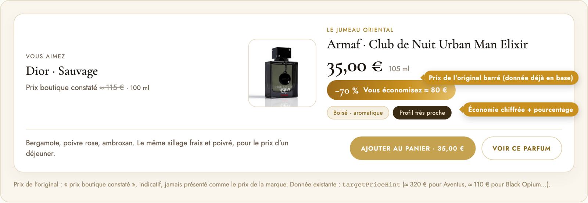

### Bénéfice

C'est l'argument n° 1 du module, enfin visible. Effet direct attendu sur le clic « Ajouter au panier » et sur le panier moyen (l'économie justifie un flacon plus grand).

### Effort

Donnée déjà présente pour les paires relues à la main ; à compléter par une petite table de prix indicatifs pour les paires calculées.

## 02. Le face-à-face des deux flacons

**Impact** ★★★★☆ Fort · **Effort** M — une à deux semaines · Vague 2 · refonte de la carte

### Constat

Le résultat est une carte de texte : le nom de l'original en lettres, une petite vignette du jumeau (116 px, 96 px en mobile) dans un cadre crème. Aucune mise en scène, alors que le module est le seul endroit du site où l'on peut jouer l'« avant / après ». Les packshots sont de formats disparates (un sticker « Victime de son succès » apparaît même sur la vignette d'Aventus).

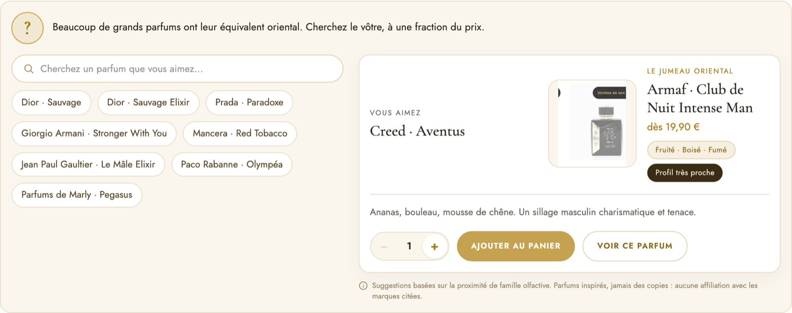

*Aujourd'hui sur l'accueil : le résultat se lit comme une fiche, pas comme une rencontre.*

### Proposition

Une scène crème avec deux flacons sur socle : à gauche un flacon neutre stylisé qui porte le nom en texte (aucun logo ni forme de flacon de marque — le cadre légal actuel est conservé), au centre un sceau doré « ≈ » avec le niveau de proximité, à droite le vrai packshot du jumeau en grand, avec son ombre. Noms, prix et boutons alignés dessous. Les vidéos de flacon déjà prévues (Salvo) s'y intègrent naturellement.

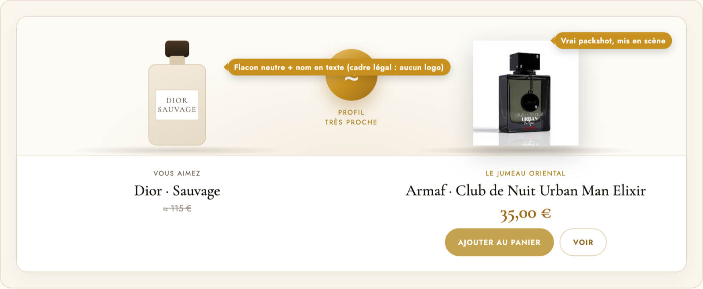

### Bénéfice

Compréhension immédiate (« celui-ci remplace celui-là »), mémorisation, et une image prête à être partagée (proposition 9).

### Effort

Nouveau gabarit de carte, flacon neutre en dessin vectoriel, recadrage des packshots pour un gabarit unique.

## 03. Une jauge de proximité que l'on comprend

**Impact** ★★★★☆ Fort · **Effort** S — quelques jours · Vague 1 · gains rapides

### Constat

Tous les résultats portent le même badge « Profil très proche » : Sauvage, Aventus, Coco Mademoiselle, Alien, Baccarat Rouge… Le moteur calcule pourtant un score de 0 à 1 et trois niveaux (très proche / proche / apparenté), mais un seul est jamais affiché. Un badge identique partout ne renseigne pas : il finit par ressembler à un slogan.

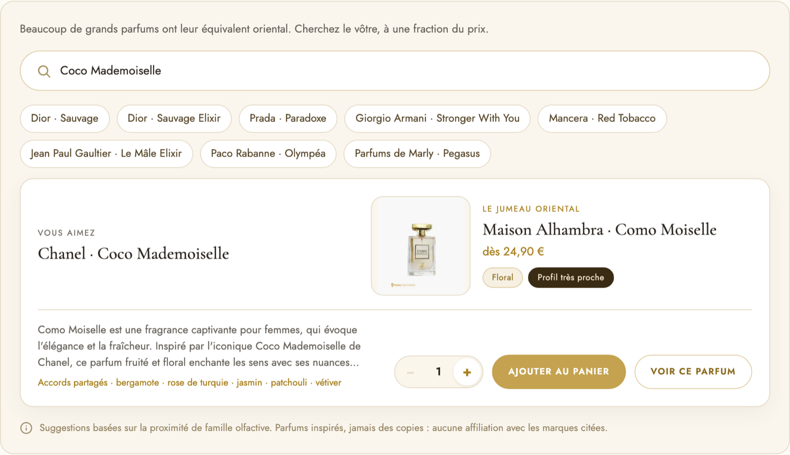

*Coco Mademoiselle → Como Moiselle : même badge que pour toutes les autres recherches.*

### Proposition

Une jauge horizontale à trois paliers, le pourcentage en grand (Cormorant), le badge du palier, et la phrase qui le justifie : « même famille · 5 accords sur 5 retrouvés ». Trois rendus selon le niveau, pour que 92 %, 74 % et 58 % ne se ressemblent pas.

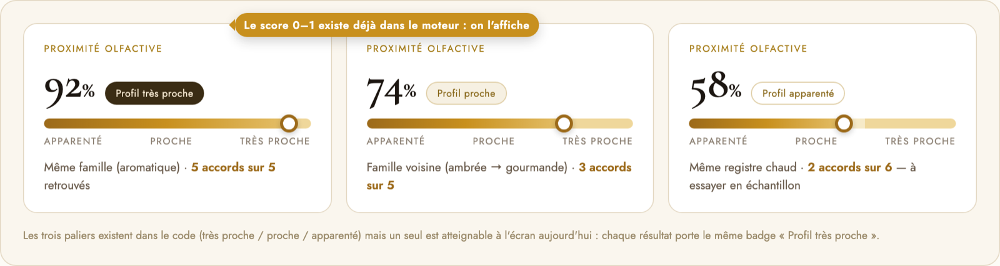

### Bénéfice

Crédibilité et aide à la décision : un « 74 % » honnête vend mieux qu'un « très proche » partout. Permet aussi de montrer des résultats « proches » (avec un échantillon à 3 €) au lieu de l'écran « pas encore de jumeau ».

### Effort

Le score, le nombre d'accords retrouvés et la taille du profil sont déjà calculés et exposés par le moteur.

## 04. Le badge de confiance : « jumeau documenté » ou « rapprochement olfactif »

**Impact** ★★★★☆ Fort · **Effort** S — quelques jours · Vague 1 · gains rapides

### Constat

Nous avons deux natures de résultats : des paires reconnues et sourcées (34 correspondances « fortes » avec leur source dans notre table), et des rapprochements calculés par ressemblance de familles et d'accords. À l'écran, rien ne les distingue : Hamidi Alyssa est servi pour Baccarat Rouge 540 et pour Alien avec la même assurance, sous le même badge.

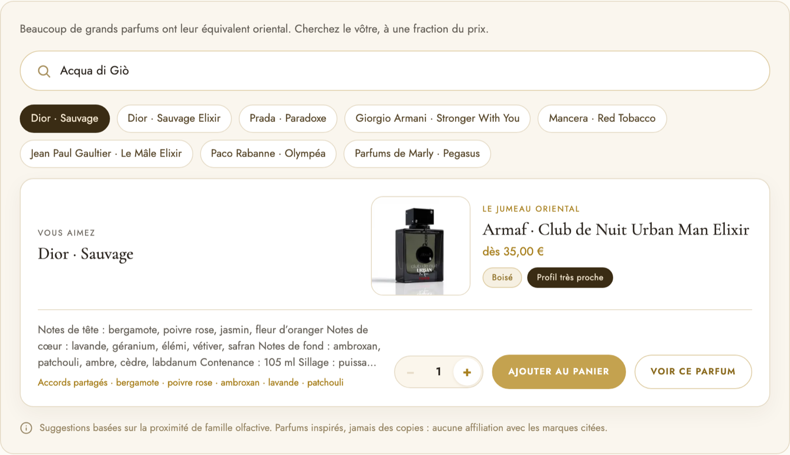

*Sauvage → Urban Man Elixir : paire relue ou calcul ? Le visiteur ne peut pas le savoir.*

### Proposition

Deux badges de natures différentes. Plein, doré : « Jumeau documenté — correspondance reconnue, relue par notre équipe · voir la source ». En contour : « Rapprochement olfactif — même famille, 4 accords en commun · essayer en échantillon ». Le second invite à l'échantillon plutôt qu'au flacon.

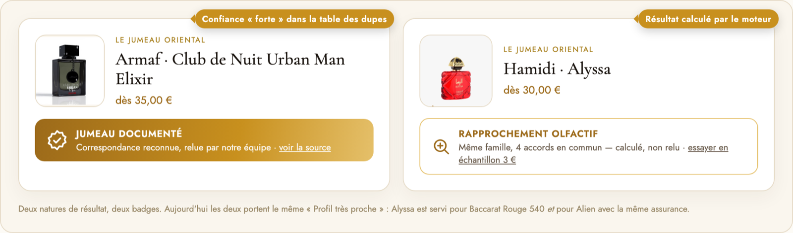

### Bénéfice

Confiance (« ils ne me racontent pas d'histoires »), différenciation face aux sites de dupes, moins de déceptions et de retours.

### Effort

Le niveau de confiance (forte / moyenne / faible) et la source existent déjà dans la table des correspondances.

## 05. Le point d'entrée : pastilles visuelles et autocomplétion qui renseigne

**Impact** ★★★★☆ Fort · **Effort** M — une à deux semaines · Vague 2 · refonte de la carte

### Constat

Les pastilles sont du texte (« Dior · Sauvage »), sans flacon ni prix, sur trois rangées en mobile derrière un « Voir plus ». L'autocomplétion liste cinq « Aventus » sans dire lesquels ont un jumeau : on découvre l'absence après le clic. Et Creed · Aventus, le résultat montré à l'ouverture, n'est même pas parmi les pastilles.

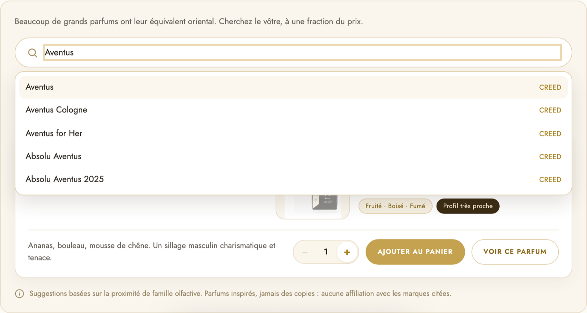

*Cinq Aventus, aucun indice sur ceux qui ont un jumeau.*

### Proposition

Des pastilles avec la vignette ronde du jumeau et le prix (« Dior · Sauvage → 35 € »). Une autocomplétion regroupée par maison, avec un monogramme neutre (pas de logo : cadre légal), l'année et la famille, et surtout l'état en bout de ligne : « ✓ Jumeau dès 19,90 € » ou « Pas encore · prévenez-moi ».

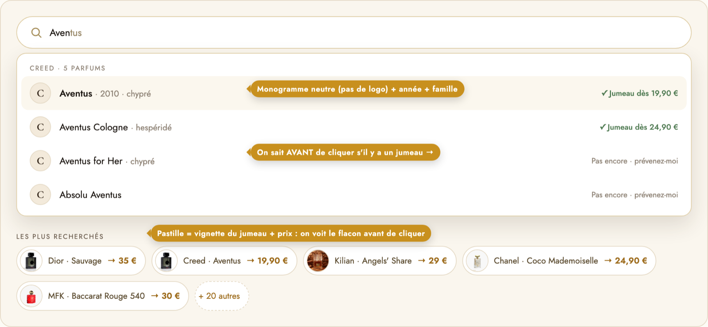

### Bénéfice

Moins de clics pour rien, le prix visible dès la liste, plus de clics sur les pastilles (on voit le flacon avant de choisir).

### Effort

La liste doit interroger le moteur pour chaque ligne (déjà en mémoire) ; les vignettes sont les photos produit existantes.

## 06. Sur mobile : la carte bord à bord et un bouton d'achat qui suit

**Impact** ★★★★☆ Fort · **Effort** M — une à deux semaines · Vague 2 · refonte de la carte

### Constat

À 390 px de large, le module fait plus de deux écrans de haut : trois rangées de pastilles, la carte, deux boutons empilés. « Ajouter au panier » n'apparaît qu'après un long défilement, et le flacon fait 96 px. Le bouton WhatsApp flottant et le bouton « remonter » viennent en plus se superposer aux boutons d'achat.

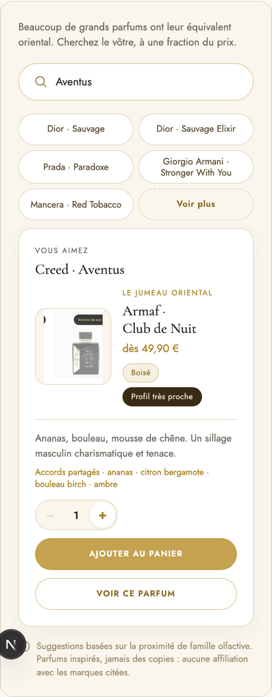

*À 390 px : le bouton d'achat arrive après un long défilement.*

### Proposition

Pastilles en carrousel horizontal (une ligne), carte bord à bord avec le flacon en grand, prix + économie + jauge, et une barre d'achat collante en bas (prix, quantité, Ajouter) tant que le résultat est à l'écran.

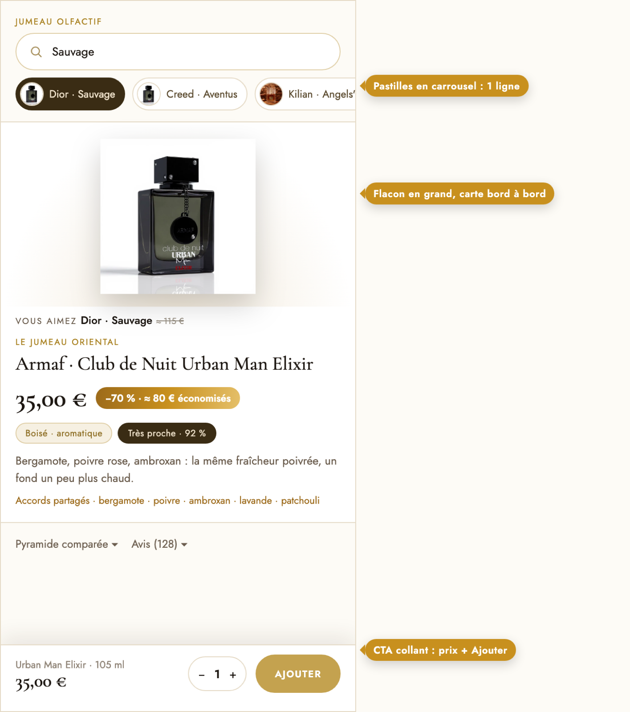

### Bénéfice

Conversion mobile — la majorité du trafic d'une boutique comme la nôtre. Moins de défilement, un geste d'achat toujours à portée de pouce.

### Effort

Surtout du style ; la barre collante s'affiche quand la carte est visible et se retire ensuite.

## 07. La pyramide de notes comparée

**Impact** ★★★☆☆ Moyen · **Effort** M — une à deux semaines · Vague 3 · finitions

### Constat

Les accords partagés sont une ligne de texte doré (« Accords partagés · bergamote · poivre rose · … »). La description est parfois un bloc brut de fiche produit — « Notes de tête : … Contenance : 105 ml Sillage : puissa… » — tronqué à trois lignes. La preuve olfactive existe mais se lit mal.

*La description brute de la fiche déborde dans la carte.*

### Proposition

Un tableau à deux colonnes (l'original / le jumeau) et trois lignes (tête, cœur, fond). Les notes communes sont surlignées or avec un point, un compteur « 6 notes partagées sur 11 », et une phrase de synthèse : « Ce que vous retrouverez … / ce qui change … ».

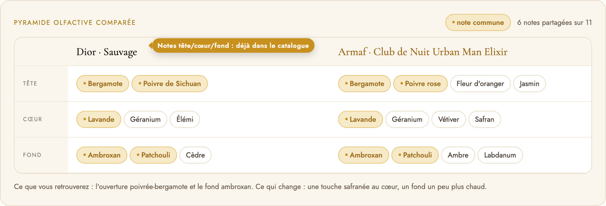

### Bénéfice

C'est la preuve : elle rassure l'amateur éclairé, remplace la description brute et réduit les retours (« il ne sent pas pareil »).

### Effort

Les notes tête / cœur / fond existent déjà dans le catalogue ; côté original, les accords sont à plat — à répartir ou à afficher en une ligne.

## 08. Un état d'ouverture qui donne envie de chercher

**Impact** ★★★☆☆ Moyen · **Effort** S — quelques jours · Vague 1 · gains rapides

### Constat

À l'arrivée, le module montre déjà un résultat imposé (Creed · Aventus → Club de Nuit) sans que rien n'ait été demandé, et sans pastille active. Le visiteur hésite : dois-je chercher, ou est-ce une publicité ? Détail gênant : le même Aventus est à 19,90 € en vitrine et à 49,90 € après une recherche.

*Aujourd'hui : un résultat imposé, aucune pastille active.*

### Proposition

Une question en Cormorant — « Quel parfum aimez-vous déjà ? » —, le champ mis en lumière avec des exemples en filigrane, trois chiffres (25 jumeaux certifiés · −70 % en moyenne · 3 952 parfums reconnus) et trois paires certifiées qui défilent doucement à la place du résultat imposé.

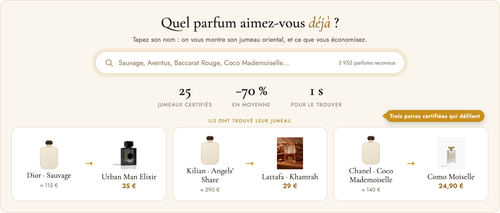

### Bénéfice

Plus de visiteurs qui tapent dans le champ — le geste clé du module — et une promesse chiffrée avant même le premier résultat.

### Effort

Composition et rotation des paires existantes ; corriger au passage l'écart de prix 19,90 / 49,90 €.

## 09. Partager son jumeau : lien direct et WhatsApp

**Impact** ★★★☆☆ Moyen · **Effort** S — quelques jours · Vague 1 · gains rapides

### Constat

Un résultat n'a pas d'adresse : impossible de l'envoyer à un ami ou de le retrouver plus tard ; en revenant sur le site tout est à refaire. Le bouton WhatsApp flottant existe déjà mais ne sait rien du résultat affiché.

*Deux boutons, aucun pour partager ou retrouver ce résultat.*

### Proposition

Une adresse par paire (dubaiparfumerie.com/jumeau/dior-sauvage) qui rouvre le module sur le bon résultat, deux boutons « WhatsApp » et « Copier le lien » sous la carte, et une image d'aperçu générée avec les deux flacons et le prix, pour que le lien reçu donne envie de cliquer.

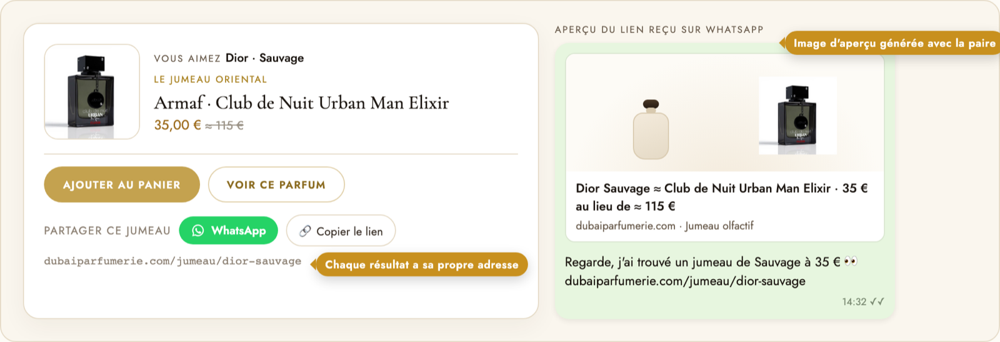

### Bénéfice

Acquisition gratuite par bouche-à-oreille (groupes WhatsApp, famille), retours sur le site, et une page indexable par jumeau pour les recherches « dupe Sauvage ».

### Effort

S pour le lien et les boutons ; M si l'on génère l'image d'aperçu.

## 10. La révélation du jumeau (animation d'une seconde)

**Impact** ★★☆☆☆ Modéré · **Effort** M — une à deux semaines · Vague 3 · finitions

### Constat

Le résultat se remplace d'un coup, sans transition : on ne voit pas qu'il a changé — surtout quand deux recherches mènent au même flacon (Alien et Baccarat Rouge donnent tous deux Hamidi Alyssa). Le moment de la « trouvaille » n'est pas mis en scène.

*Le résultat change sans qu'on le voie changer.*

### Proposition

Une séquence d'une seconde : le champ reste, l'ancienne carte s'estompe, un squelette doré le temps de la recherche, le flacon glisse depuis la droite, la jauge se remplit, le prix compte à rebours et l'économie apparaît en dernier. Désactivée pour qui a demandé « réduire les animations ».

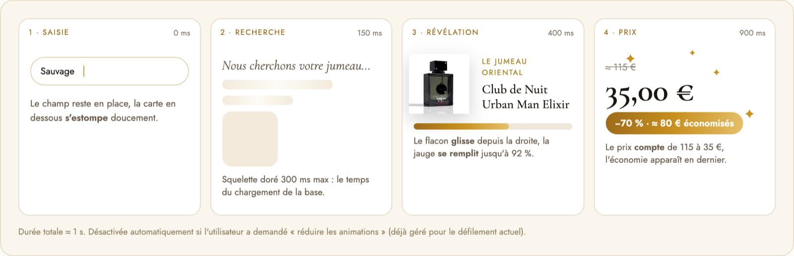

### Bénéfice

Sensation de découverte, perception de qualité, et le changement de résultat devient visible.

### Effort

Styles et quelques états ; à faire après les propositions 1 à 3, qu'elle met en scène.

## Récapitulatif impact × effort

| N° | Proposition | Impact | Effort | Vague | Gain rapide |
|---|---|---|---|---|---|
| 01 | Prix économisé | ★★★★★ Très fort | S | 1 | Oui |
| 02 | Face-à-face des flacons | ★★★★☆ Fort | M | 2 | — |
| 03 | Jauge de proximité | ★★★★☆ Fort | S | 1 | Oui |
| 04 | Badge de confiance | ★★★★☆ Fort | S | 1 | Oui |
| 05 | Point d'entrée visuel | ★★★★☆ Fort | M | 2 | — |
| 06 | Mobile : carte + CTA collant | ★★★★☆ Fort | M | 2 | — |
| 07 | Pyramide comparée | ★★★☆☆ Moyen | M | 3 | — |
| 08 | État d'ouverture inspirant | ★★★☆☆ Moyen | S | 1 | Oui |
| 09 | Partage / lien direct | ★★★☆☆ Moyen | S | 1 | Oui |
| 10 | Animation de révélation | ★★☆☆☆ Modéré | M | 3 | — |

## Ordre de mise en œuvre recommandé

1. **Vague 1 — gains rapides (1 à 2 semaines)** : 01 Prix économisé · 03 Jauge · 04 Badge de confiance · 08 État d'ouverture · 09 Lien direct + WhatsApp. Aucune nouvelle donnée nécessaire.
2. **Vague 2 — refonte de la carte (2 à 3 semaines)** : 02 Face-à-face · 05 Point d'entrée visuel · 06 Mobile bord à bord + CTA collant. Prérequis : packshots recadrés à un gabarit unique.
3. **Vague 3 — finitions (1 à 2 semaines)** : 07 Pyramide comparée · 10 Animation · image d'aperçu de partage.

### Corrections de données à faire en même temps

- Aligner prix et nom d'Aventus → Club de Nuit (19,90 € « Intense Man » en vitrine, 49,90 € « Club de Nuit » après recherche).
- Remettre Creed · Aventus dans les pastilles, ou ouvrir sur Dior · Sauvage — pas les deux.
- Nettoyer les descriptions contenant « Contenance », « Sillage »… avant affichage dans la carte.

Mesure conseillée après la vague 1 : taux de clic « Ajouter au panier » depuis le module, part des visiteurs utilisant le champ, nombre de partages.
